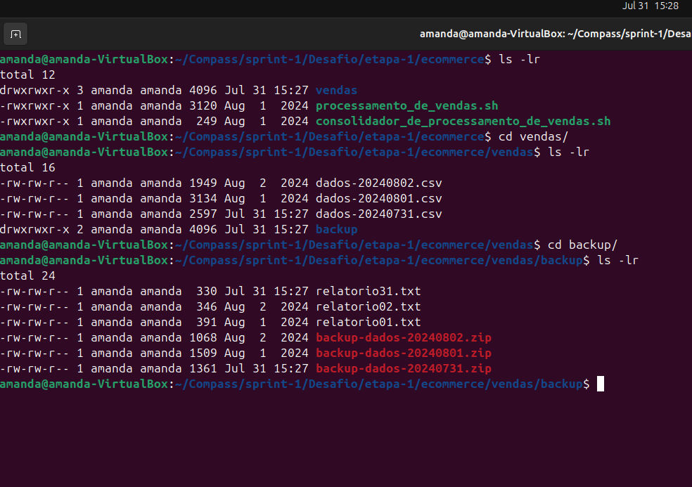
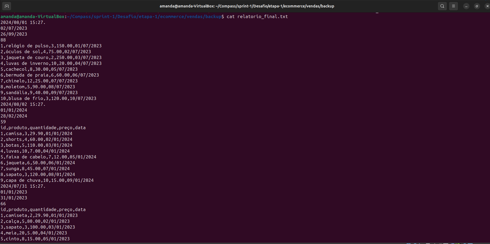
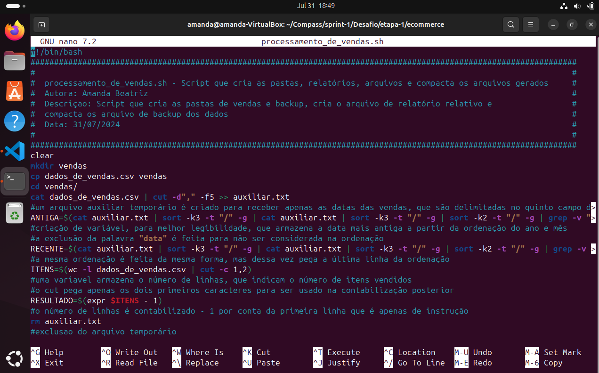
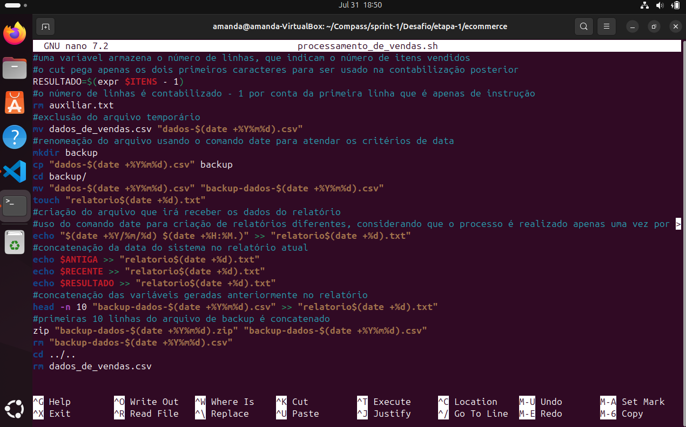
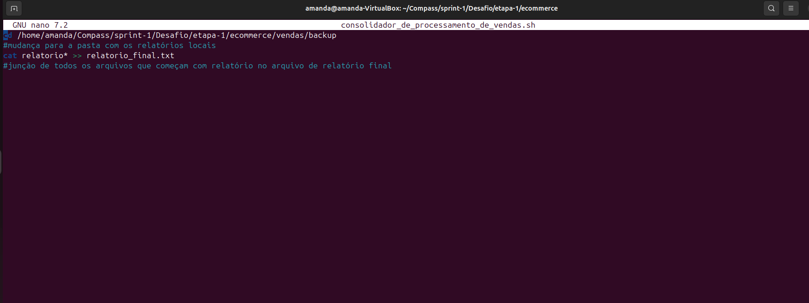
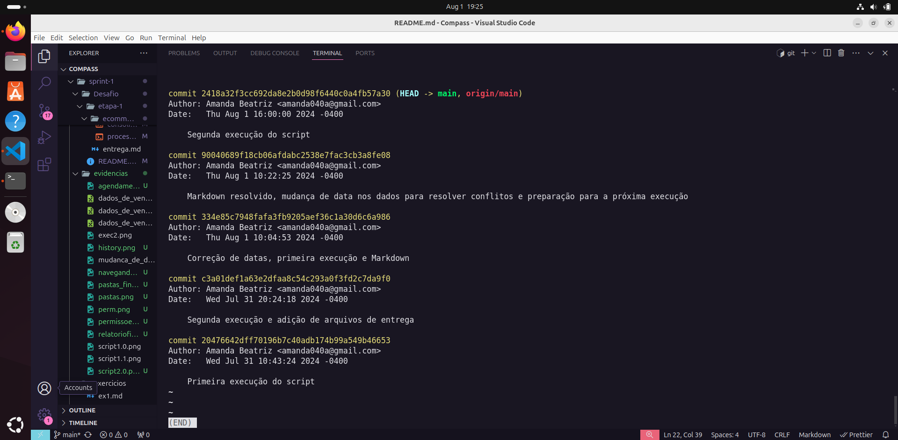

# Exercícios

1. script 1
[Resposta Ex1.](exercicios/ex1.md)

2. script 2
[Resposta Ex2.](exercicios/ex2.md)

# Entregáveis

* Todos os arquivos de vendas gerados em [Dados 1](evidencias/dados_de_vendas.csv), [Dados 2](evidencias/dados_de_vendas2.csv) e [Dados 3](evidencias/dados_de_vendas3.csv)
* Todos os scripts gerados em: [pasta ecommerce](Desafio/etapa-1/ecommerce/)
* Evidências abaixo e em [Evidências](evidencias/)
* Reexecução e mais informações em: [Entrega](Desafio/etapa-1/entrega.md)
* Etapas em: [Desafio](Desafio/README.md)
  

# Evidências

Ao executar o código do exercício observei que a saída no terminal informa a porcentagem de redução do tamanho do arquivo e após a primeira execução mostra que algumas pastas não podem ser criadas pois já existem, mas o resto do código segue com êxito, conforme podemos ver na imagem a seguir:
Mais evidências e arquivos de dados gerados em: [Evidências](evidencias/)

Após a execução no terceiro dia essas foram as pastas geradas e as datas.

O agendamento foi feito via cron, o comando ficou assim na listagem:

As permissões de execução também foram setadas, e a de leitura também caso necessário.

Após o desencontro de informações refiz a primeira execução para arrumar os dados dos relatórios e o novo resultado foi esse:

E o novo relatório final não possui mais erros de data.

Para fazer isso esses foram os scripts necessários, também disponível no formato txt em: [codigo1.txt](evidencias/codigo1.txt) e [codigo2.txt](evidencias/codigo2.txt)
Também em formato Markdown em: [codigo1](exercicios/ex1.md) e [codigo2](exercicios/ex2.md)

E por fim, o histórico de commits:

# Certificados
