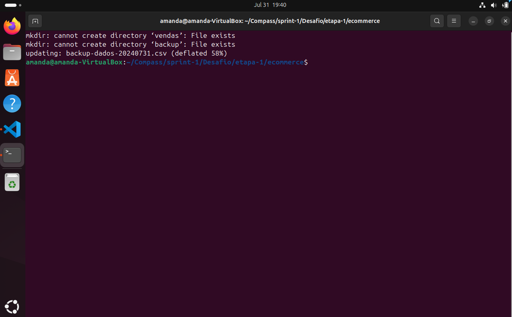

# Exercícios

1. script 1
[Resposta Ex1.](exercicios/ex1.md)

2. script 2
[Resposta Ex2.](exercicios/ex2.md)

# Evidências

Ao executar o código do exercício observei que a saída no terminal informa a porcentagem de redução do tamanho do arquivo, após a primeira execução mostra que algumas pastas não podem ser criadas pois já existem, mas o resto do código segue com êxito, conforme podemos ver na imagem a seguir:
Mais evidências e arquivos de dados gerados em: [Evidências](evidencias/)

# Certificados
