## Entregáveis 

[Evidências](../evidencias/README.md)

## Desafio

O desafio consistiu na criação de um dashboard responsivo, como os dados já estavam prontos foi necessário juntar todas as dimensões à tabela fato dentro do QuickSight.

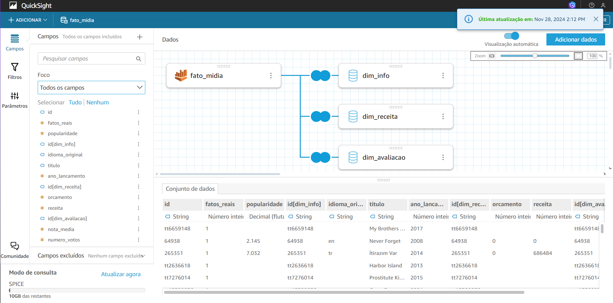

 Apenas dois campos calculados foram criados: Lucro (com a diferenã entre a orçamento e a receita dos filmes que possuiam esse dado) e Fatos Reais (com a substituição do de 1 e 0, para Sim e Não em relação a ser ou não baseado em fatos reais, deixando o dashboard mais intuitivo).

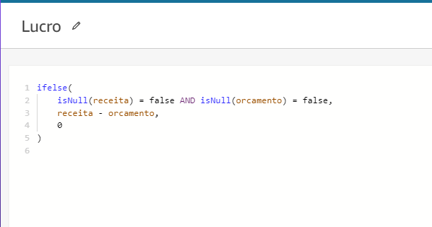

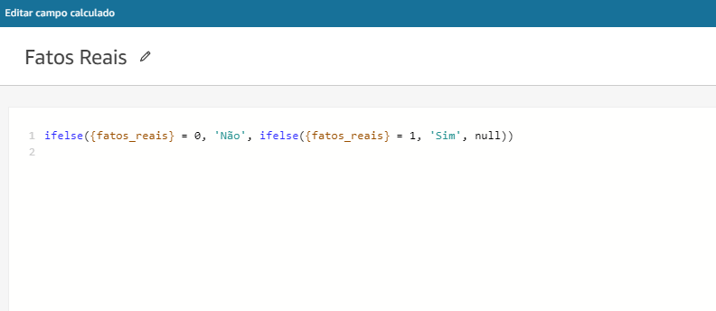

Após isso os gráficos, tabela e insight estavam prontas para ser criadas com as métricas abaixo:

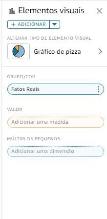
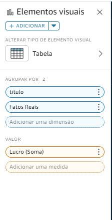
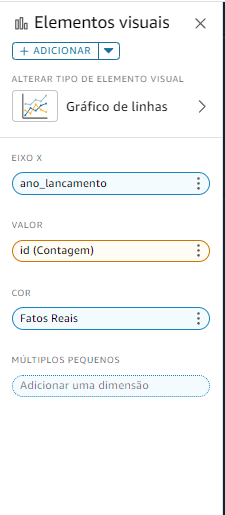
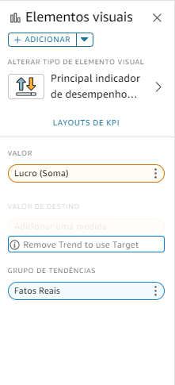

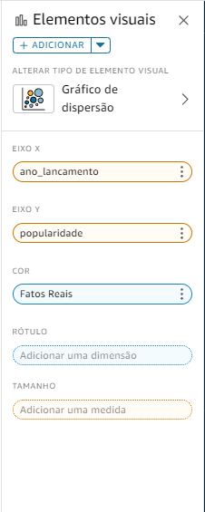
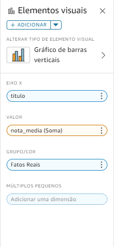
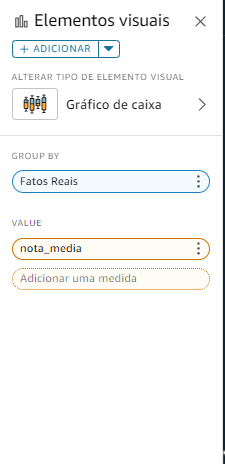

Adicionando a responsividade, com um controle de dados a serem analisados e possibilidade de interação com a tabela, esse foi o resultado final:

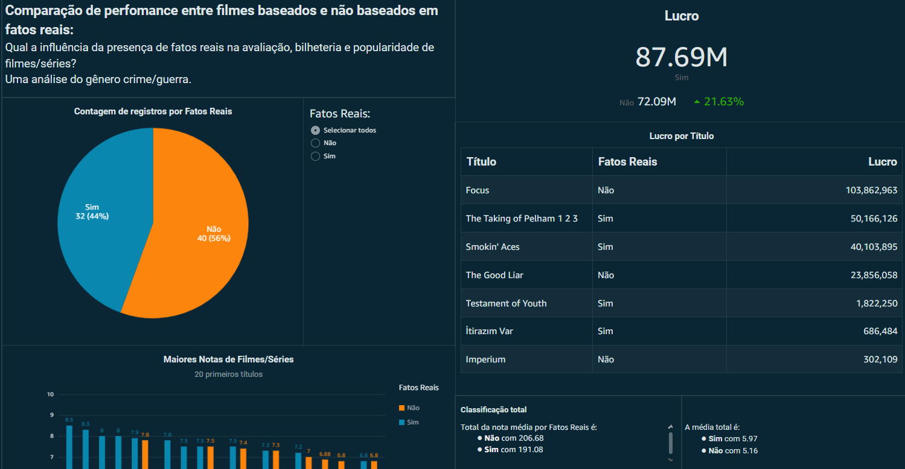
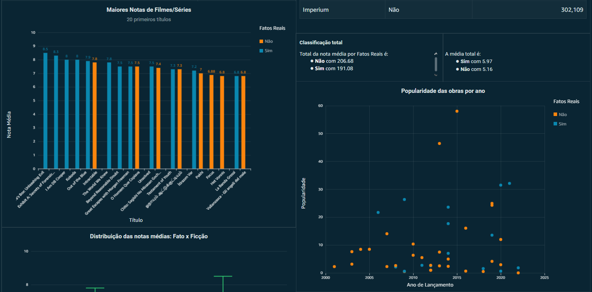
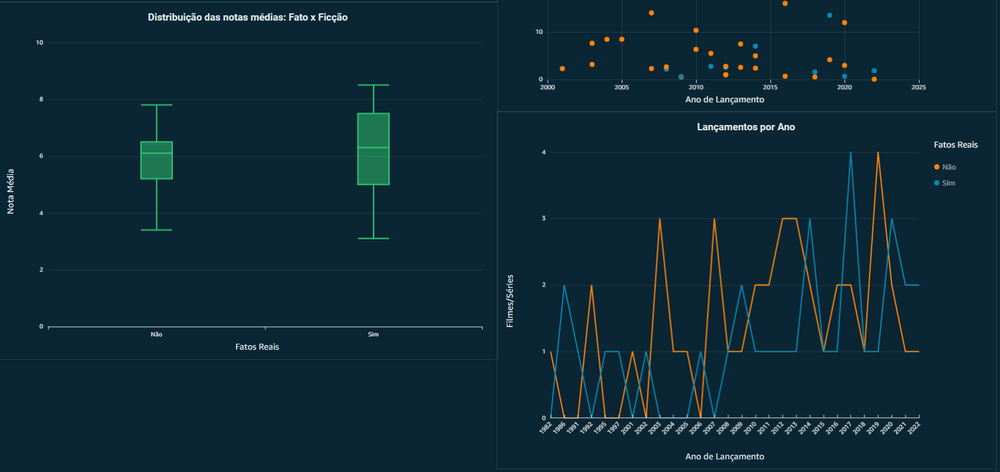

O gráfico responde as perguntas feitas mostrando o resultado das comparações usando as métricas da amostra analisada, onde filmes baseados ou inspirados em fatos reais aparecem com números maiores na maioria dos gráficos. Mostrando que eles normalmente chamam mais a atenção do público e da crítica, tudo isso baseado na amostra de títulos coletada.

