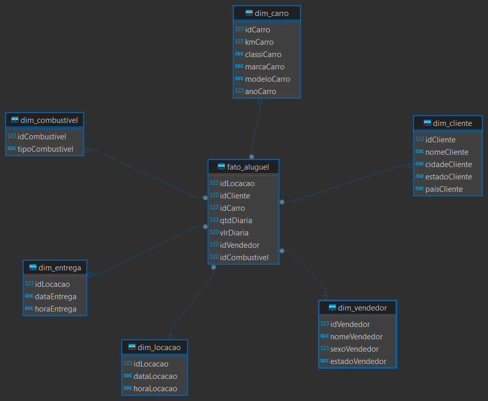

# Desafio

1. **Normalização**

   1.1 **Primeira Forma Normal**

       Na primeira forma normal, separei a tabela inicial em tabelas menores para separar as colunas que possuíam
       mais de um dado e aproveitei os formatos de data que já estavam separados em data e hora.

   1.2 **Segunda Forma Normal**

       Separei em mais tabelas para juntar cada coluna dependente de sua chave, criando tabelas por categoria,
       por exemplo: Cliente, Vendedor, etc.

   1.3 **Terceira Forma Normal**

       Eliminei atributos dependentes de outros na tabela. No caso, separei o endereço do cliente da tabela cliente.

2. **Dimensinal**
    Mantive muitas colunas e tabelas, apenas mudando o relacionamento e criando a tabela fato(apenas com dados numéricos) que liga todas as dimensões.

3. **Desenhos**

    * Modelagem Relacional
    
    Obs: o modelo no DBeaver não gerou o relacionamento desejado, o programa utilizado foi o Astah utlizando o modelo de diagrama de classes mas similar ao crow's foot.

    * Modelagem Dimensional
    

4. **Entregáveis**

* Arquivos SQL gerados:
[Relacional](../evidencias/concessionariarelacional.sqlite)
[Dimensional](../evidencias/concessionariadimensional.sqlite)

## Detalhes

O modelo dimensional gerado foi o star pela falta de relações entre as dimensões e por ser mais comum.
Leitura dos conceitos de BigData realizada.
