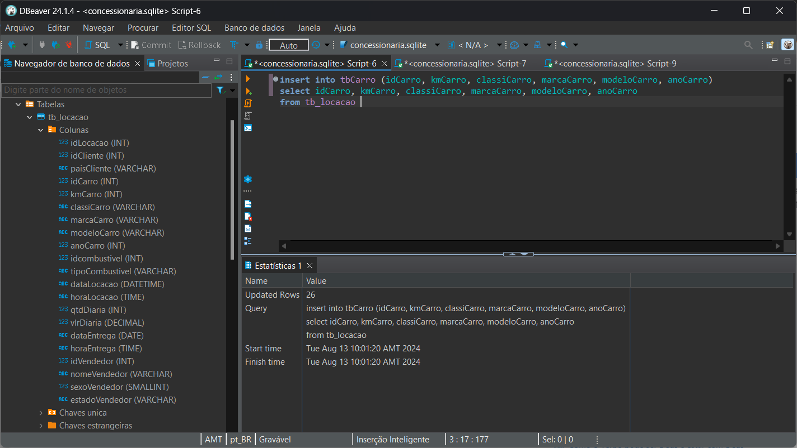

# Projeto

# Exercícios

Ao executar os exercícios primeiramente no DBeaver, o SGDB retornava o código solicitado ou o erro, alguns exerícios foram mais complicados como o 4 ou a partir do 8 que precisei utilizar "subqueries". Todas as evidências dos códigos em: [Evidências](../exercicios/) (Formato PNG e TXT)

Utilização de "SubQuery"

[Exercício 4](../exercicios/biblioteca/E04.txt)

# Exportação de dados

A parte principal da exportação de dados foi feita pela interface gráfica do DBeaver onde era possível escolher o separador dos arquivos .csv e comandos básicos de SQLite. Resultados:
[Separador "|"](../exercicios/exportação/5_Editoras.csv)
[Separador ";"](../exercicios/exportação/10_MaisCaros.csv)

# Desafio

A execução do desafio começou pela normalização da tabela fornecida até a terceira forma normal, para chegar nesse nível de formalização precisei separar em tabelas menores ligando cada coluna a sua chave na tabela, utilização do select distinct para não repetir valores nas tabelas em que fosse necessário e por último a criação do diagrama usando o Astah após tentativas falhas no DBeaver. Códigos usados para a criação das tabelas menores e mais específicas em: [Tabelas](../evidencias/tabelas.txt)
Exemplo criação e inserção dos dados em tabelas:

Após fazer o mesmo com todas as tabelas esse foi o resultado

O mesmo processo foi empregado para a criação da tabela dimensional, mas dessa vez com a criação de uam tabela fato que liga a todas as tabelas dimensão, gerando as tabelas:

O modelo relacional e dimensional geraram os seguintes diagramas, respectivamente:

