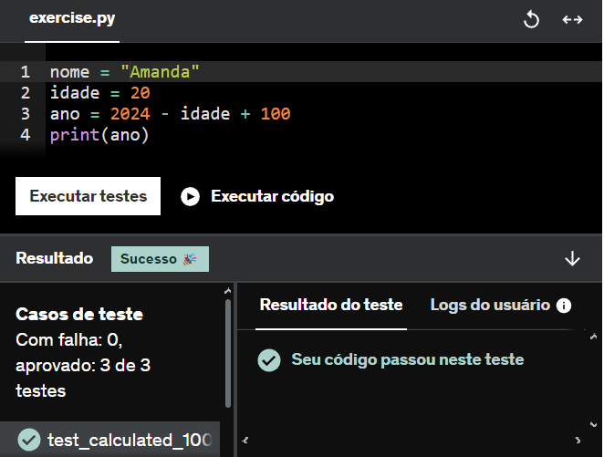
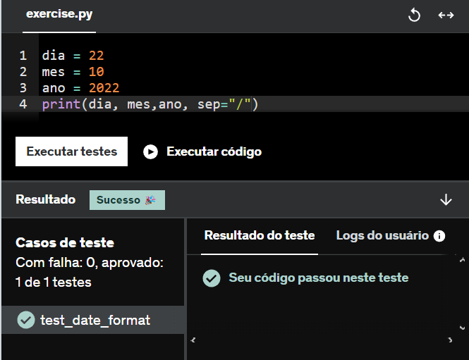
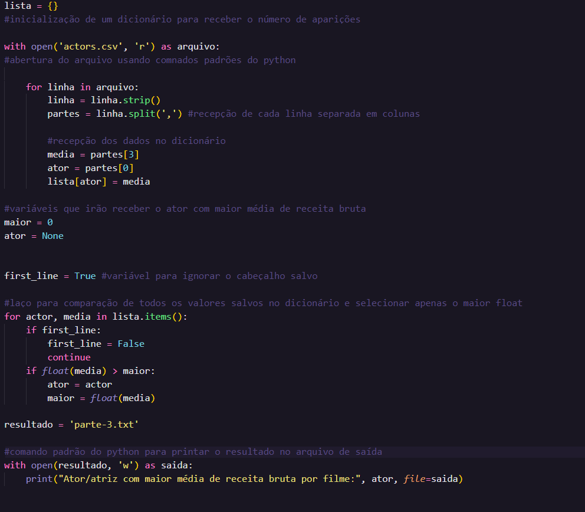
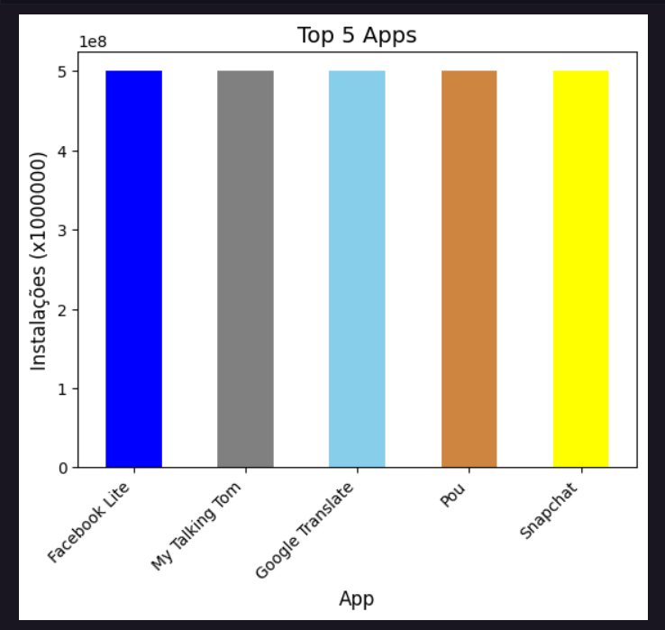
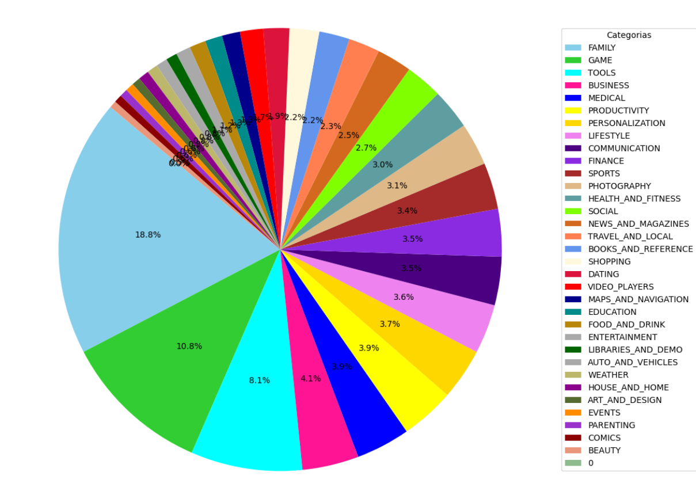
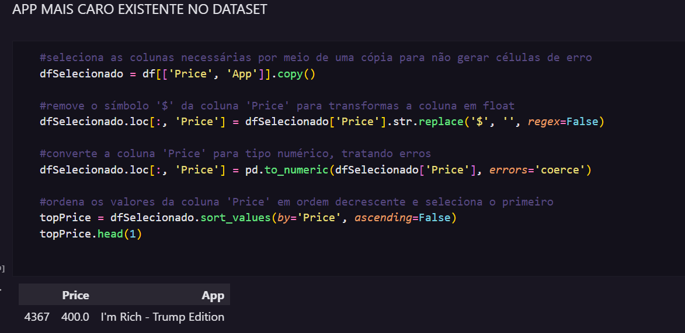
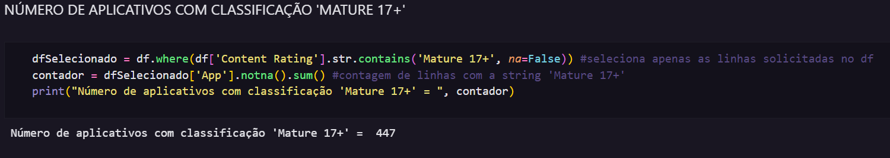

# Exercícios

Ao executar os primeiros exercícios não tive muita dificuldade, tive mais problemas com os exercícios focados em orientação à objetos, principalmente em entender as saídas.

Exercício de POO
#
#[Exercício 4](../exercicios/biblioteca/E04.txt)

# ETL

Toda a parte de ETL foi feita com os comandos padrões do python, algumas tinham a lógica parecida então foram mais fáceis de fazer, como exemplo abaixo a etapa 3:

[Código](../exercicios/ETL/codigo3.py)
[Saida em txt](../exercicios/ETL/parte-3.txt)

# Desafio

A execução do desafio começou pela instalação das bibliotecas pendentes e auxílio de materiais externos para aprender o necessário sobre plotar gráficos, particulamente a análise e extração dos dados com o Pandas foi mais fácil do que a criação de alguns gráficos que precisavam de muito tratamento.

Gráfico gerado com alguns problemas, sem a utilização da categoria "Outros" alguns dados de porcentagem sobrescrevem a outra e algumas cores geradas não se destavam muito pela grande quantidade de categorias.

Ao mostrar, o próprio Jupyter gera uma tabela com os dados selecionados.

Os gráficos escolhidos foram o de dispersão(App melhor avaliado) e de linha(Tops Apps por tamanho em MB), por se tratar de um dado de apenas um valor o gráfico de dispersão ficou parecido com o gráfico de linha.

## Detalhes
Na confecção do desafio acehi necessário preencher uma coluna faltante no arquivo csv manualmente, tive o mesmo problema no arquivo csv do ETL, mas contornei de outras formas.
+1 Curso AWS completo!