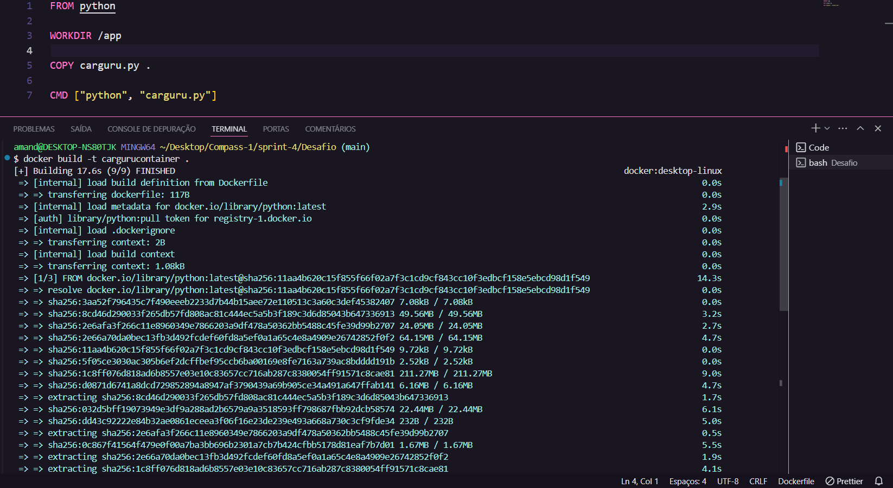
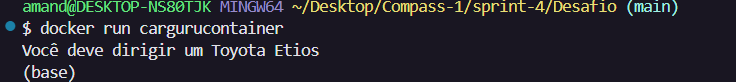
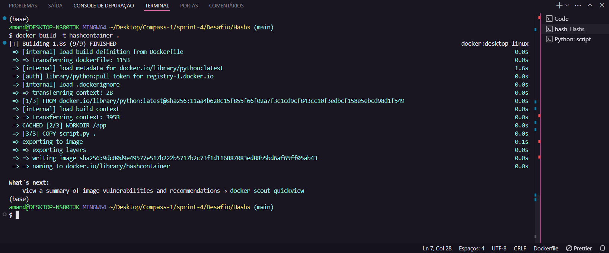
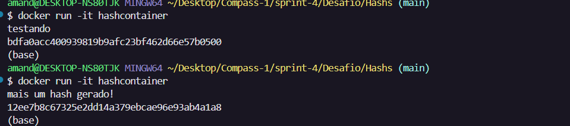

# Desafio

Após criar o primeiro arquivo dockerfile com os quatro comandos básicos de Docker, precisei fazer o build da imagem para poder transformá-lo e rodá-lo como container no meu sistema.

Utilizando o comando docker run para executar o container obtive a geração pelo carguru.

Fiz o mesmo processo de build com o segundo container solicitado.

Mas dessa vez rodei o container com o comando docker run -it para poder testar o hash das strings, e obtive o seguinte resultado:

