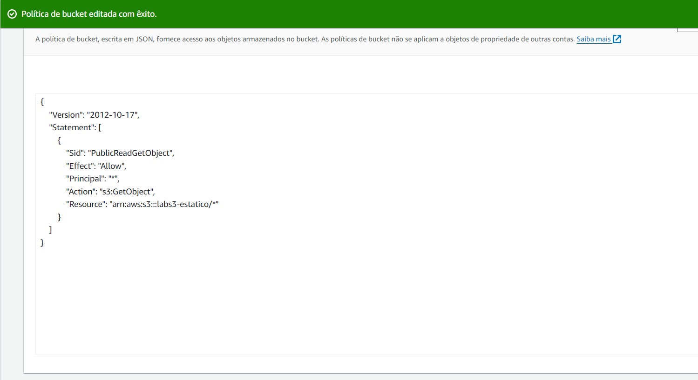
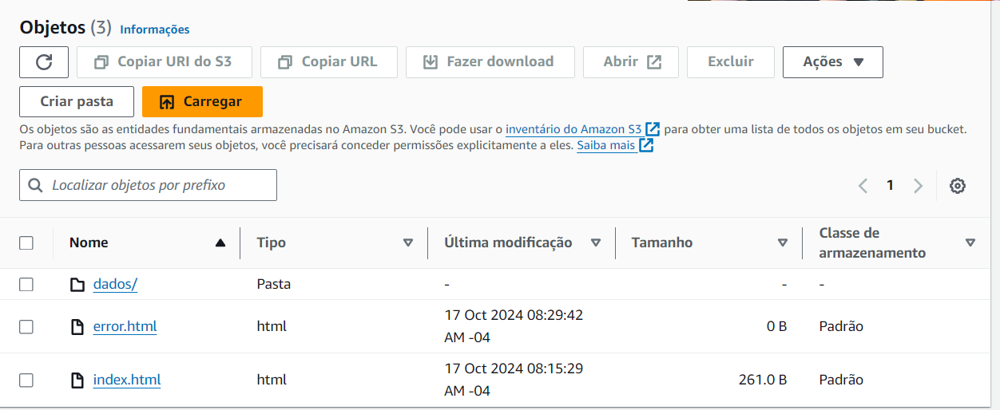
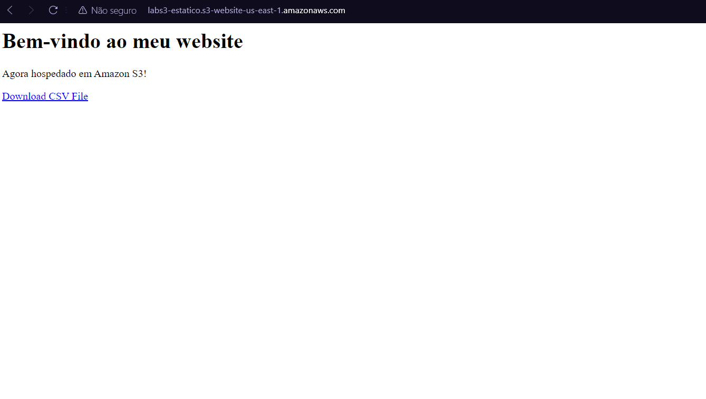
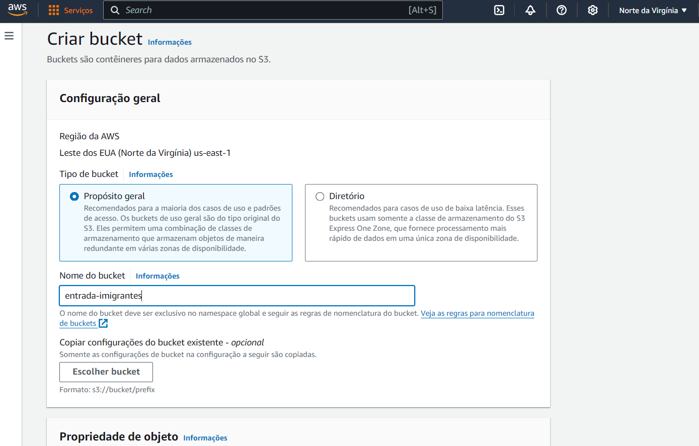
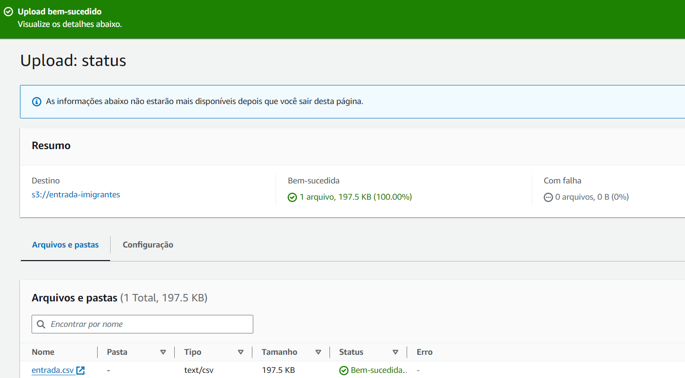
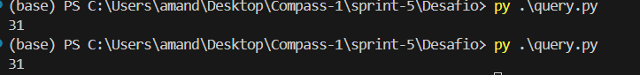

# Cloud Quest

O jogo Cloud Quest da Amazon foi finalizado na sprint 5, abaixo estão dois exeplos de desafios de laboratório realizados durante o jogo:

# Exercício

A realização do lab AWS começou com a criação de um bucket e logo após sua configuração de privacidade, abaixo como exemplo a confiuguração de política do bucket para 'apenas leitura':

Em seguida foi preciso colocar objetos no site para a configuração do site estático.

No final esse foi o resultado do site estático:

# Desafio

Para a relização do desafio era necessário antes de tudo criar um bucket utlizando o console da Amazon para armazenar o arquivo csv escolhido.

Depois do bucket ser criado, esse é o resultado:

Analisei o arquivo dispónivel no bucket entrada-imigrantes que é justamente um csv com os dados de algumas entradas de imigrantes no Brasil a partir de 1881.
Após isso foi necessário criar um código python em que faço uma seleção de dados utilizando o Pandas: [Código](../Desafio/query.py)
Para testar o funcionamento dos comandos primeiro realizei o teste para gerarum pequeno resultado listando as linhas com limitação de sobrenomes.

Após verificar que tudo estava funcionando corretamente deixei código mais complexo para receber como retorno a diferença de anos da primeira e última entrada de imigrantes com os sobrenomes da minha família selecionados(de Jesus, de Carvalho, Carvalho e Marques), realizando algumas extrações e conversões no caminho. Esse foi o resultado:
