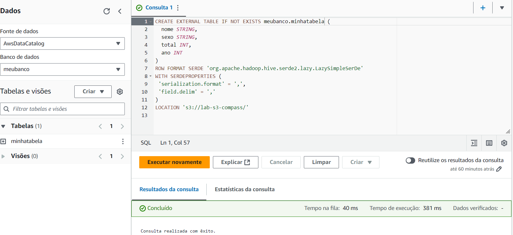

# Exercícios

## Lab AWS Athena
O laboratório do Athena começa com as configurações básicas dentro do console de escolha de arquivo em um bucket e criação da tabela pela interface que gerou o código abaixo:

Após isso foram realizados alguns cósigos fornecidos na Udemy para testes, depois do teste é solicitado a criação do código abaixo para a listagem dos nomes mais usados por década.

E parte do resultado foi esse:

## Lab AWS Lambda

O laboratório lambda foi um pouco mais complexo, após a etapa de criação da função no console usei o código fornecido na Udemy para implementar a função do lambda.

E o resultado após o test no lambda foi esse:

Para obter esse resultado foi necessário criar uma camada(layer) no Lambda para implemnetar a biblioteca pandas na minha função na AWS. Para isso segui os passos da criação de um container com o docker para salvar os arquivos a serem salvos na layer. Abaixo o arquivo Dockerfile criado e imagens da criação:

[dockerfile](../exercícios/Dockerfile)

# Desafio

Para a execução do desafio antes de tudo foi necessário criar um bucket pelo próprio consolde da AWS que nomeei de 'data-lake-amanda'.

Após isso foi necessário a criação do código [bucket.py](../Desafio/bucket.py) em que copio os arquivos CSV da minha máquina localmente. Porém o desafio era executar esse código em um container em que o csv são volumes, então precisei adaptar o código adicionando as chaves de acesso (única forma que consegui). Abaixo imagens da criação do container e utilização dos volumes:

O resultado foi gerado na AWS, onde foram criadas a pastas da Raw Zone no S3, abaixo a navegação pelas pastas até a chegada nos arquivos CSV salvos:

E por fim o arquivo movies.csv como exemplo:

# Certificados

## Ceritificados AWS

