# Exercícios

## Spark
Para começar a realização do exercício de Spark precisei antes de tudo baixar a imagem do jupyter/all-spark-notebook para poder rodar o container.
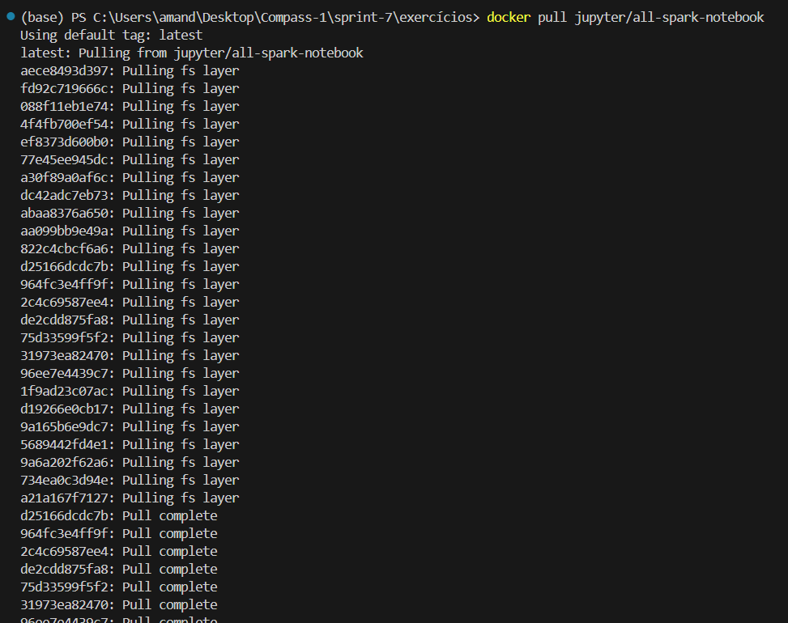

Após criar um container com a imagem baixada, gerei o ip para acesso do notebook pelo navegador como mostrado abaixo:
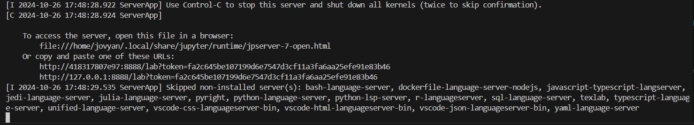
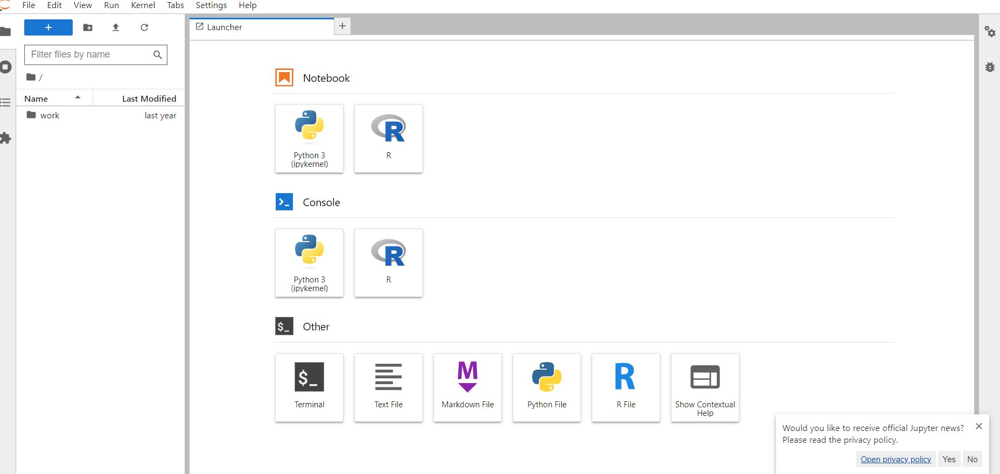

Em outro terminal acessei o shell interativo do mesmo container. Para baixar o README.md do meu GitHub foi necessário usar o comando "curl" e um token de acesso já que o repositório das sprints é privado. Depois de acessar o shell do pyspark as imagens abaixo mostram o código rodado e alguns exemplos do respectivo resultado:
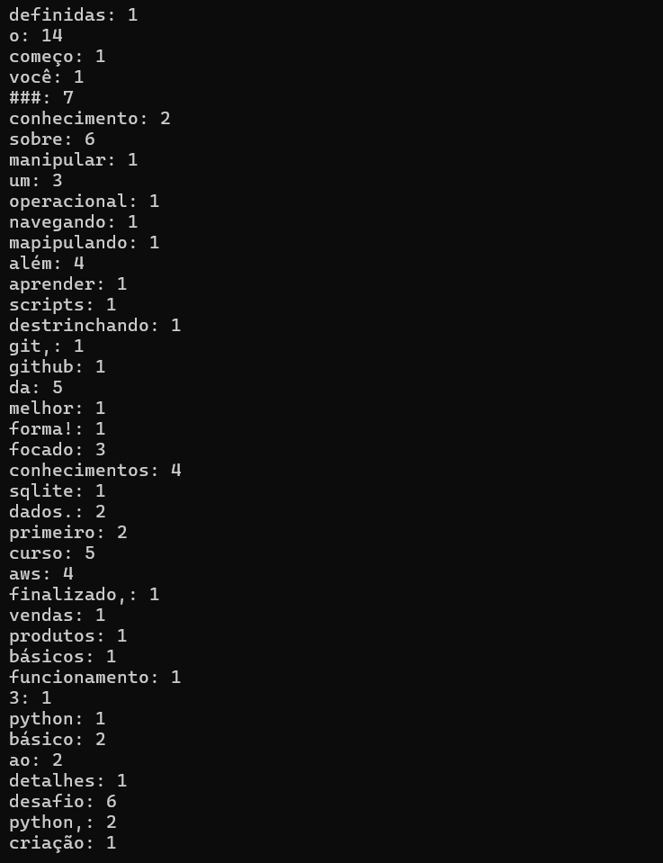
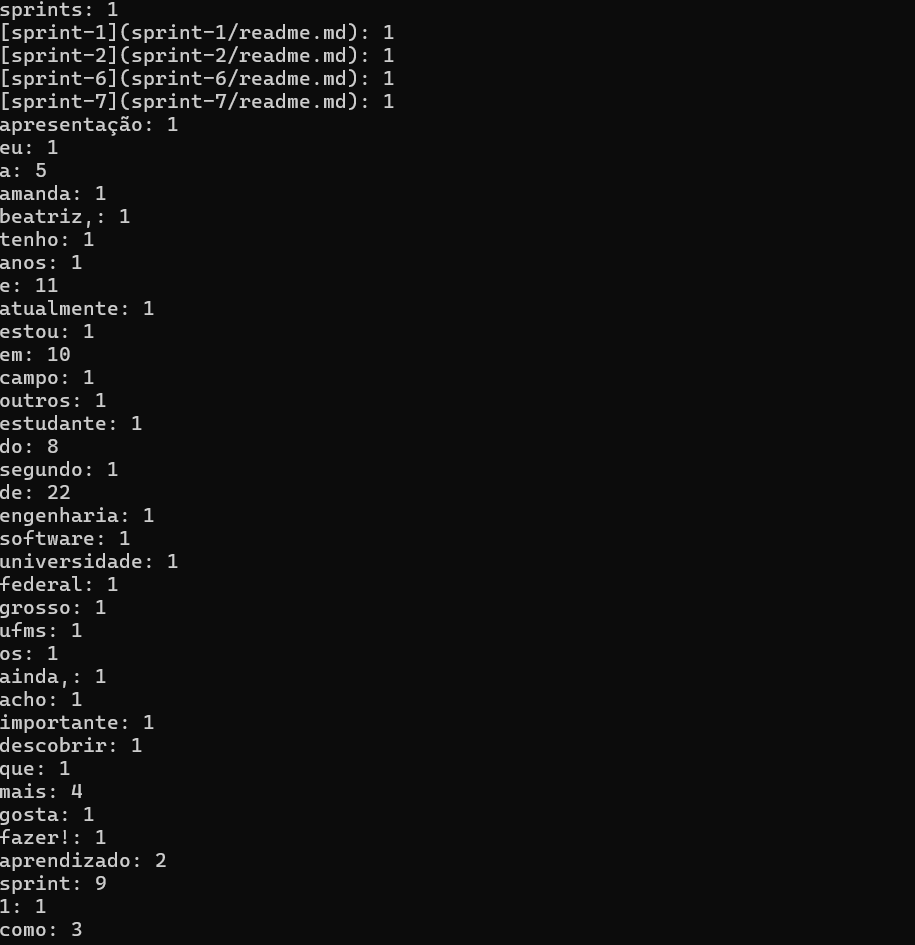

O código utilizado está salvo em: [spark](../exercícios/spark.py)

## AWS Glue
Para o exercício com o AWS Glue, antes mesmo de começar a execução foi necessário criar um usuário no IAM em que concedi permissões de administrador como a conta padrão criada pela Compass. Após criar o usuário foi possível inicar o exercício com a criação do usuário do Glue, que no meu caso foi "labglue", e concedi todas as permissões citadas no arquivo. O mesmo foi feito no Lake Formation.
A criação do job foi basicamente seguir os passos citados no PDF, apenas algumas mudanças de opção do console que foi atualizado e alguns nomes mudaram, mas a parte mais importante se manteu praticamente a mesma.
Após isso foi necessário criar um script com algumas funções básicas e outras mais complexas do Spark. O código utilizado está em [glue](../exercícios/glue.py) e logo abaixo sua execução depois de algumas tentivas falhas.
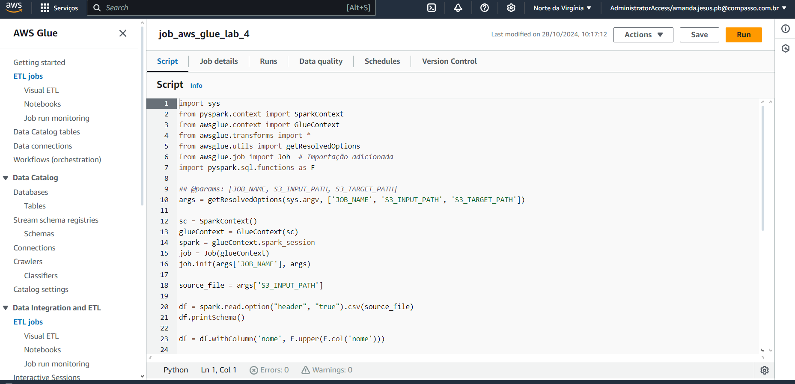
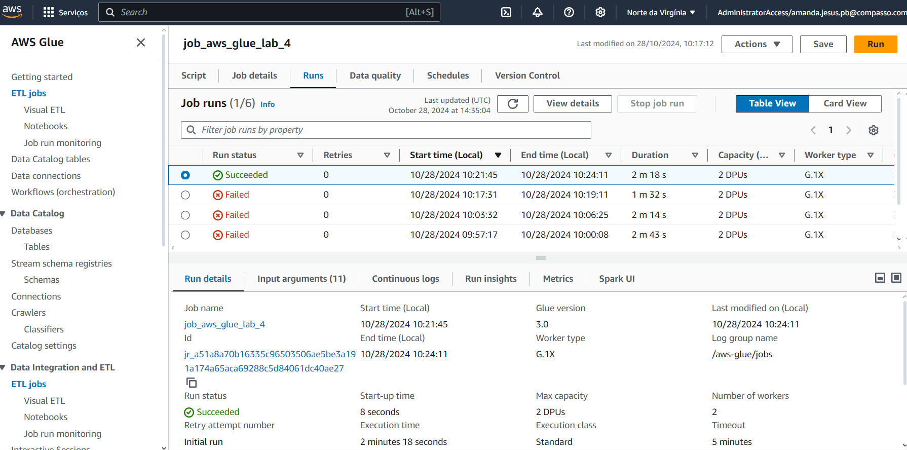

Abaixo as configurações de caminho dos arquivos em job details:
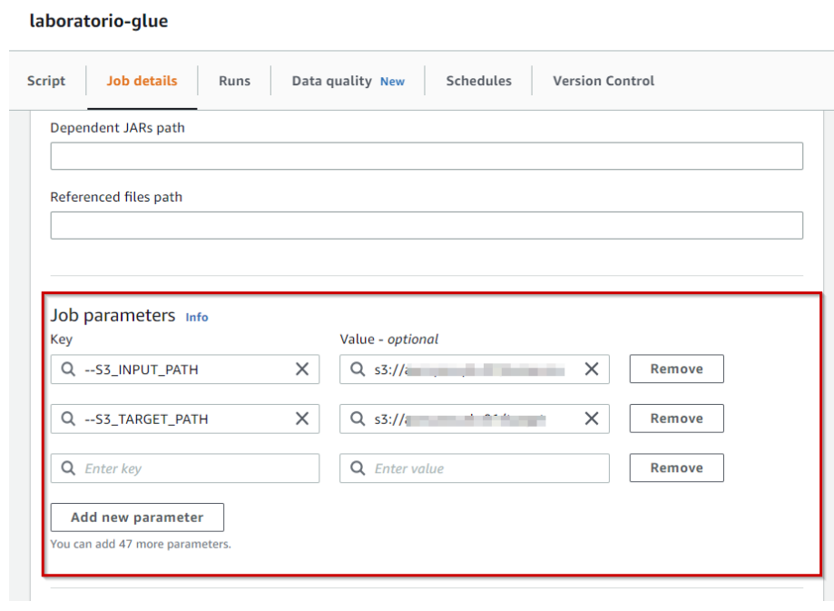

Então os resultados podem ser vistos nos arquivos salvos no bucket dentro do subdiretório requisitado no PDF.
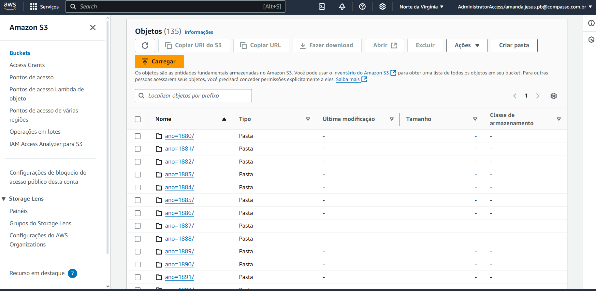

No exercício também foi solicitado o faça você mesmo de um crawler criado anteriormente.
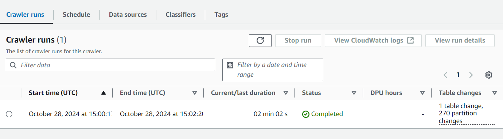

Abaixo as permissões necessárias para uso no Athena como solicitado no faça você mesmo do exercício:
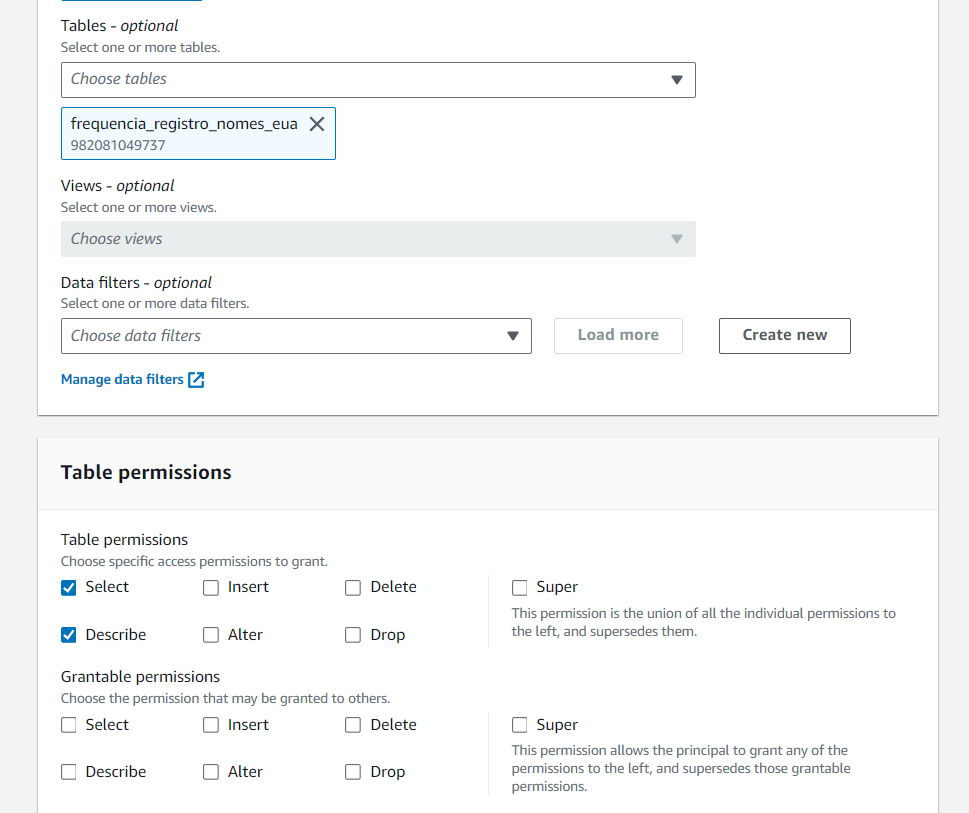

# Desafio

Para o desafio primeiro criei um código python de teste para fazer a ingestão de um arquivo com 100 filmes usando a API do TMDB, após verificar que o código funciona migrei para o lambda onde dizer que mudar para 20 filmes ou séries por arquivo para melhor perfomance, além disso precisei separar em dois códigos: um para ingestão de filmes e outra para séries, assim consegui gerar os dois tipos de mídia. O código usado foi [lambda.py](../Desafio/lambda.py), nele usei a chave da API gerada após cadastro no site do TMDB e também requets para salvar os arquivos em um arquivo JSON antes de fazer o upload, sempre tomando cuidado com as restrições citadas no desafio.
Os tratamentos necessários foram de data e gênero, para pegar filmes de crime ou guerra(tema da SQUAD 2) lançados nos anos 2000, já que senti falta deles nos arquivos CSV.

Antes de rodar o código precisei adicionar duas camadas no lambda: a do Pandas para os tratamentos citados acima(utilizei o criado anteriormente no exercício da sprint 6) e também de requests. Para criar as camadas me baseei no exercício da sprint anterior e utilizei o docker para criar aqruivos zipados com as bibliotecas. O código sendo executado pode ser visto abaixo.
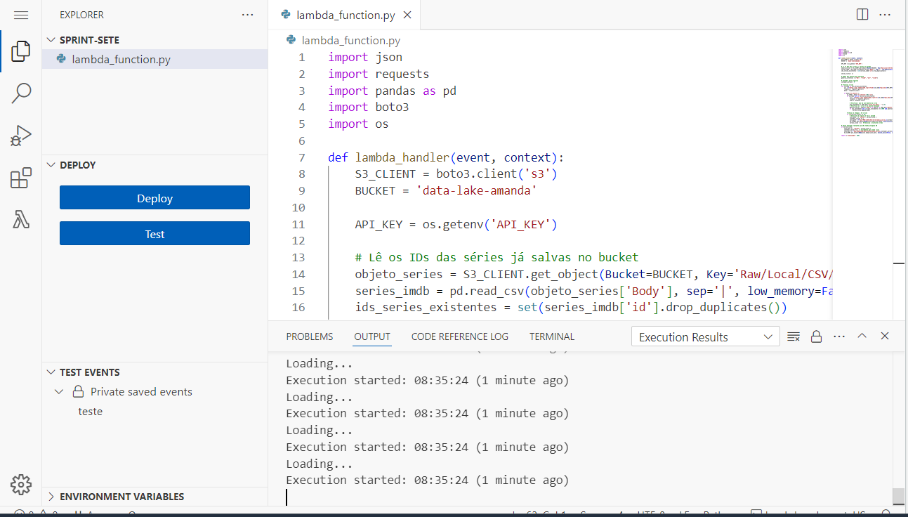

O que gerou 18 objetos no bucket, 1 de teste, 7 de séries e 10 de filmes, o que achei o suficiente para minha análise. Essas informações e o caminho solicitado dos arquivos salvos podem ser vistos na próxima evidência.
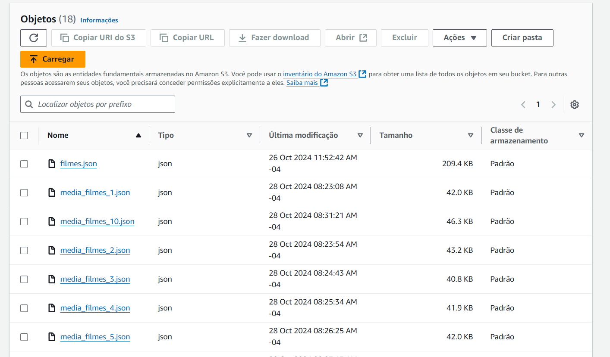

Mais informações do Desafio como os entregáveis de detalhamento do tema e da API utilizada estão em: [README DESAFIO](../Desafio/README.md)
