# Exercícios

## Spark

Para os exercícios Spark Batch usei apenas funções padrões do python como estava descrito na documentação dos exercícios e obtive os seguites resultados, para os exercícios de nomes, animais e geração de números, respectivamente:
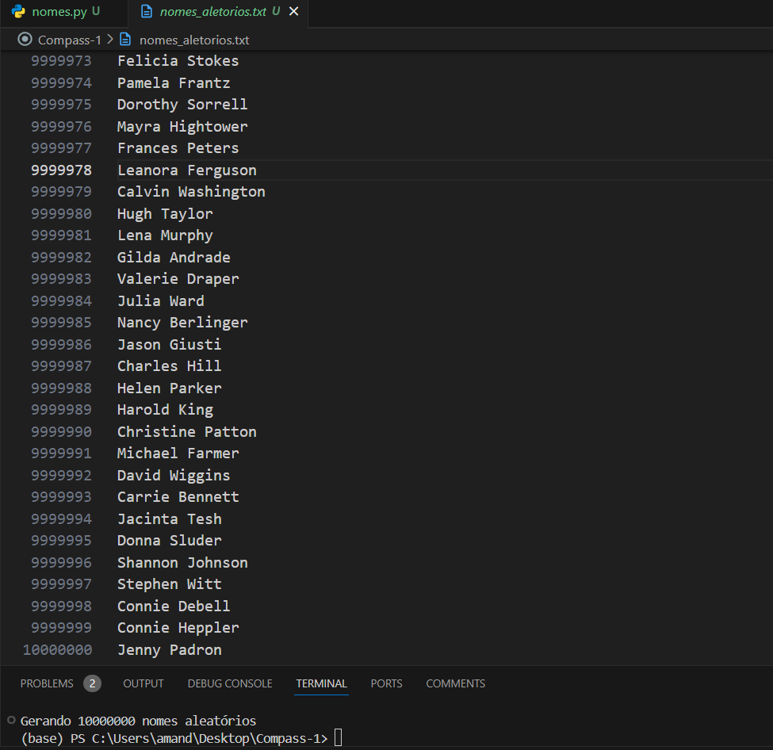

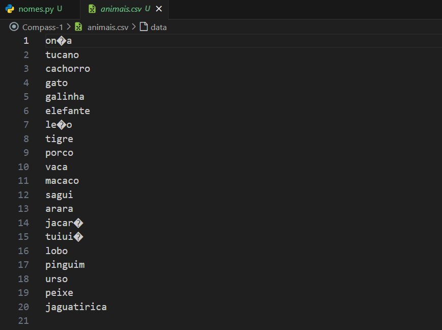

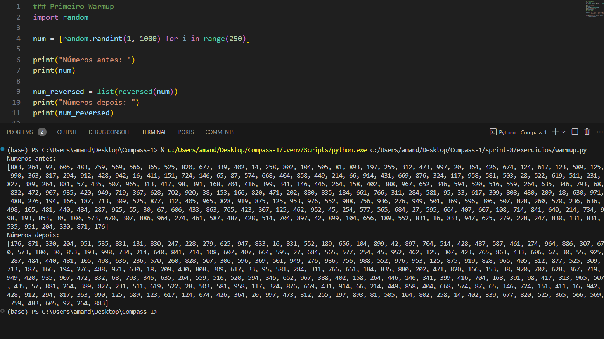

Depois do warmup foi necessário criar meu própio código para para manipular o dataframe de nomes gerado anteriormente. Em que primeiramente analisei o schema e renomeei como solicitado.
[schema](./schema_renomeado.png)

Na próxima etapa usei a função rand que gera um número aleatório de 0 a 1, e multiplico de acordo com o número de opções, nesse caso haviam três, então de acordo com o resultado atribuo uma escolaridade, como mostra no código [spark](../exercícios/Spark%20Batch/spark.py), gerando o resultado abaixo:
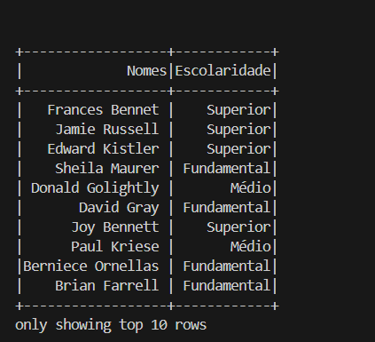

Para adicionar a coluna pais, primeiro criei uma lista com todos os países da América do Sul e usei a mesma técnica citada anteriormente, mas dessa vez multipliquei por 13 (que é o número de países), e atribui os países aleatoriamente.
Já para os anos de nascimento foi um pouco diferente, multipliquei pelo número da diferença entres os anos 1945 e 2010, e arrendondei para gerar um número inteiro para o ano de nascimento
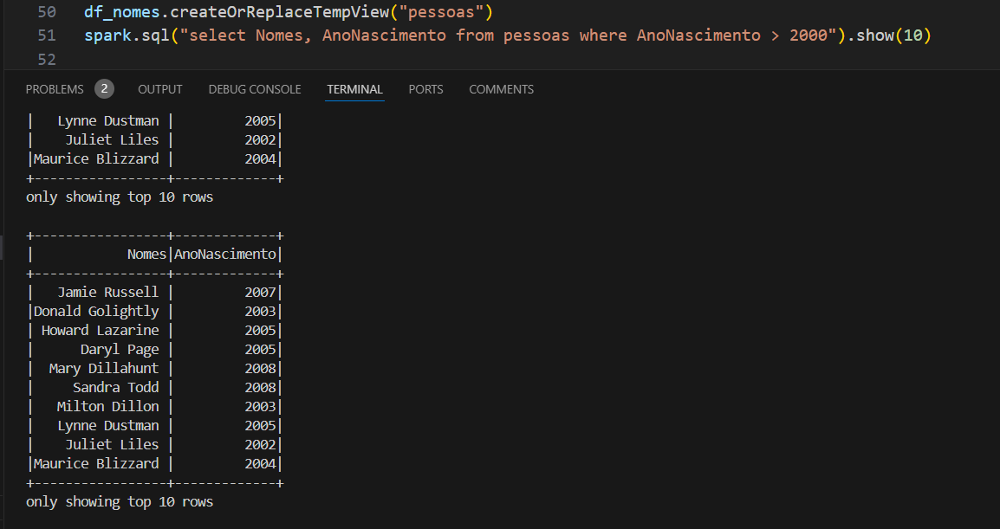

Após isso apenas fiz uma seleção das pessoas com AnoNascimento > 2000 para o df_select, e repeti o mesmo com o sql como mostra o código [spark](../exercícios/Spark%20Batch/spark.py)
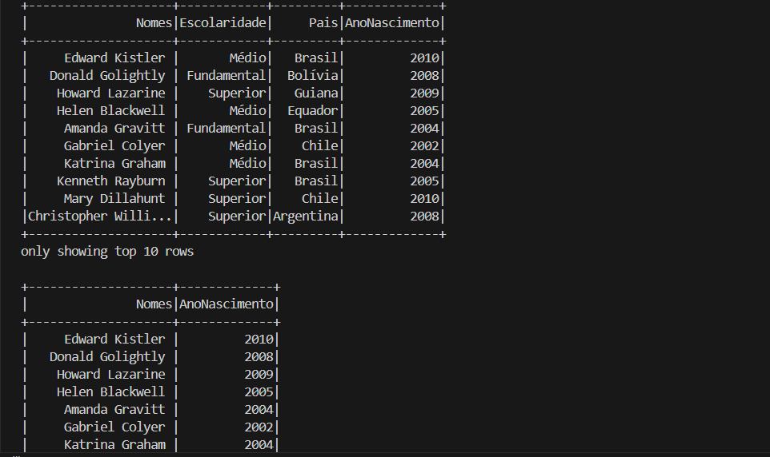

Nessa etapa a maior diferença foi usar o método count no código
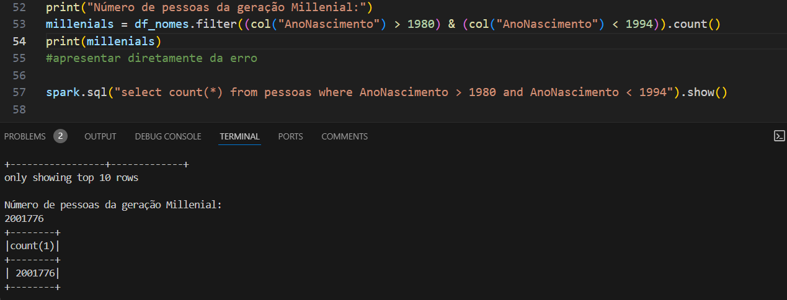

O último código SQL foi o maior, onde realizei a contagem de geração por cada país, esse foi o resultado:
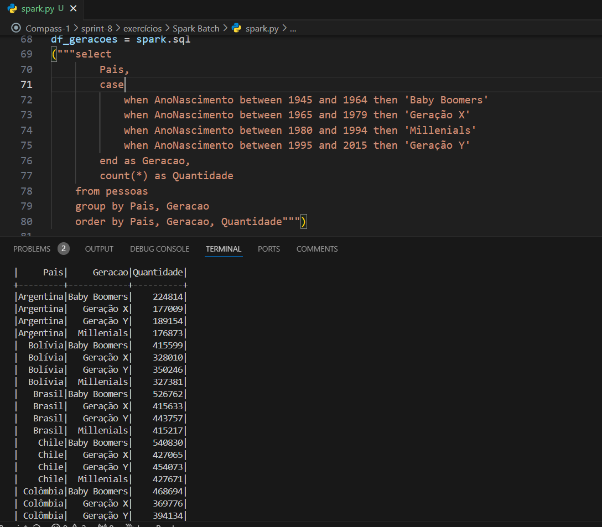
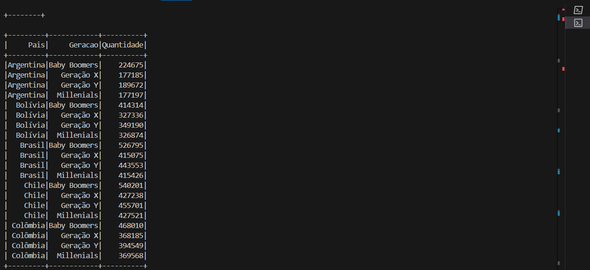

## TMDB

No exercício TMDB foi mais fácil já que grande parte já havia sido feito na sprint anterior para a ingestão dos arquivos, a chave API já havia sido gerada como mostra as imagens a seguir.
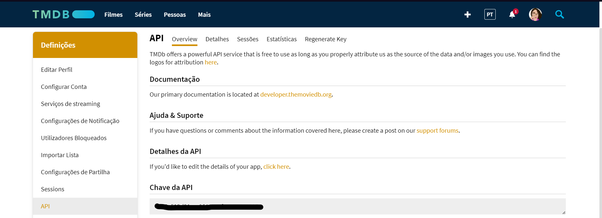

Após gerar a chave, usei a requisição para gerar o filmes usados no desafio como mostra a imagem abaixo:
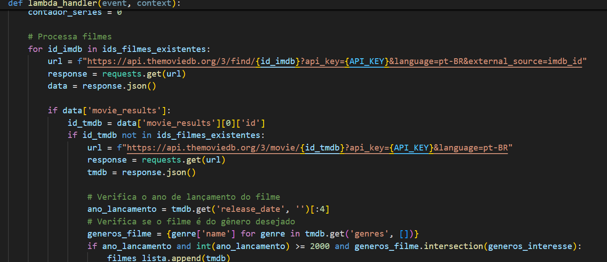

# Desafio

Comecei o desafio criando um novo job no Glue com as informações descritas na documentação, e após analisar meus dados fui para o Script Editor do job criado.
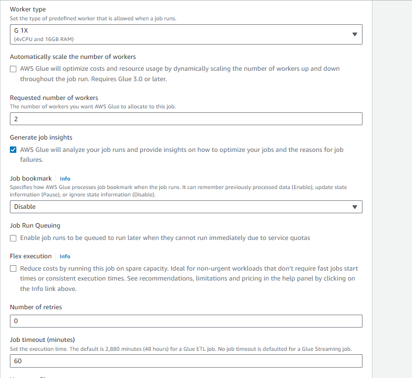

Para o desafio primeiro criei um código usando Spark para a transformação em parquet de todos os meu dados gerados durante as sprints anteriores, para transformar o CSV foi rápido, mas os arquivos JSON causaram muitos problemas.
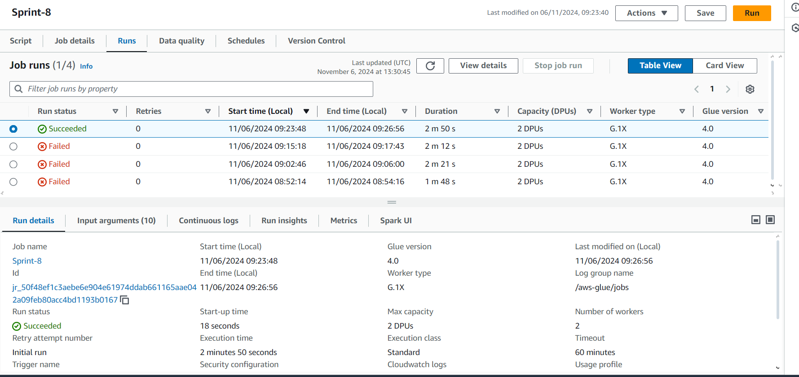

Como não consegui instalar o apache na minha máquina local demorei algum tempo até entender a estrutura do arquivo json pelo Glue, a maioria dos erros causados eram pelo fato do spark não ler por default múltiplas linhas e os JSON gerados na sprint anterior serem estruturados por listas. Após descobrir isso precisei explodir os arquivos para conseguir transformar em parquet corretamente.

Para o tratamento dos dados, por enquanto, apenas selecionei filmes aleátorios, usando a técnica que aprendi nos exercícios, para uma análise mais próxima da realidade usando o spark.

Após rodar o script do CSV e JSON separadamente, obtive como resultados os arquivos PARQUET que foram armazenados na estrutura de pastas mostrada abaixo:
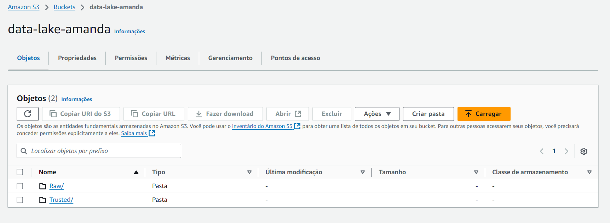

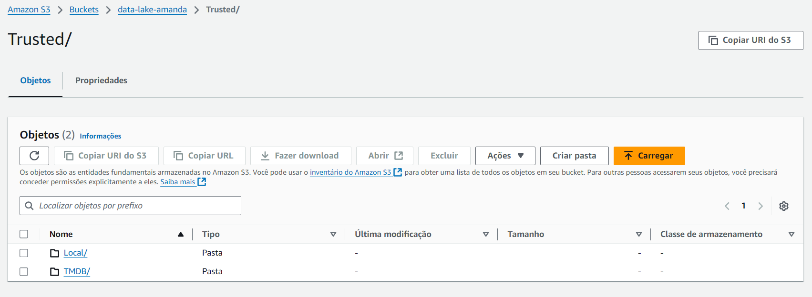

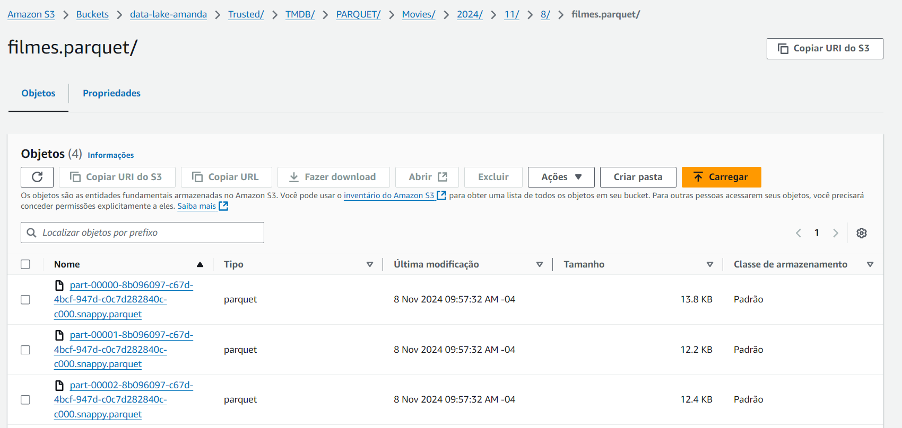

Após isso coloquei os dados no Athena apenas para testar se os dados estavam formatados corretamente, o que me fez perceber os erros descritos anteriormente e percebi que precisaria explodir o arquivo.
Para a última etapa pretendo filtrar melhor os arquivos, pegar mais filmes e séries do csv, adicionar a coluna boolean para 'FatosReais' e estrutar num banco de dados.

Mais informações do Desafio como os entregáveis de detalhamento do tema e da API utilizada estão em: [README DESAFIO](../Desafio/README.md)
Códigos usados no Glue em: [csv](../Desafio/codcsv.py) e [json](../Desafio/codjson.py)
