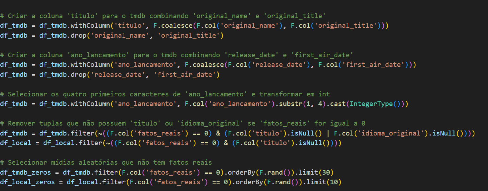

# Desafio

## Modelagem Dimensional

Antes de iniciar o desafio foi necessário criar um modelo dimensional com os dados presentes na camada Trusted. Ela foi dividida em uma tabela fato e três dimensões: fato_midia, dim_avaliacao, dim_receita e dim_info, Onde:
fato_midia = contém a chave primária id que define todos os filmes e séries, além da popularidade de cada um e a coluna fatos_reais, que se o inteiro for igual a 0 indica que não é baseado ou inspirados em fatos reais e se 1, o contrário.
dim_avaliacao = contém a nota média e número de votos de cada mídia, além do id que é a chave estrangeira que liga a dimensão à tabela fato.
dim_receita = contém o orçamento, a receita gerada por cada mídia e id como chave estrangeira.
dim_info = possui as informações mais importantes dos filmes e séries: título, ano de lançamento, linguagem original e o id de cada um.
O id foi considerada FK de todas as dimensões, já que todas elas se referem a métricas da própria mídia e não há outras dimensões, como atores, que podem estar separados de um filme.

A modelagem pode ser visualizada abaixo:

## Camada Refined

A camada Refined foi definida à partir da modelagem usando um código em PySpark para ser usado dentro do Glue.
Nessa etapa do desafio criei a coluna 'fatos_reais' de acordo com uma lista de filmes baseados/inspirados em fatos reais de acordo com os filmes coletados da camada Trusted. Após a criação na nova coluna, uma quantidade parecida de filmes que não entram nessa categoria são selecionados de forma aleaótria. 
Nessa parte também selecionei apenas as colunas necessárias para a última sprint, deixando assim os dados prontos para análise
O tratamento também foi feito com o casting de colunas deixando os dois dataframes (local e TMDB) compatíveis, dentro de TMDB o mesmo foi feito, além da junção de colunas para tirar as diferenças entre dados de filmes e séries. Código em: [código](../Desafio/refined.py).
Finalmente, os resultados do parquet local e do tmdb foram unidos em um só para serem salvos novamente no S3, dessa vez na camada Refined.
Parte do cósigo pode ser vista na imagem:

## AWS Glue

Abaixo podem ser vistas as tentativas feitas para o resultado final dentro do AWS Glue, o número de tentativas aumentou de acordo com o resultado gerado a cada tentiva, mudanças como o número de filmes não baseados/inspirados em fatos reais selecionados e mais filtros para gerar resultados mais completos.

## Resultados

Os resultados foram analisados dentro do Athena. Após a criação do crawler com a pasta gerada em data-lake-amanda/Refined, a tabelas ficam disponíveis no Athena por meio do Glue Catalog.

Para análise uma query básica foi feita com a união de duas tabelas, os resultados estão abaixo, alguns dados estão como nulos pois os dados locais eram menos completos que os do tmdb.

